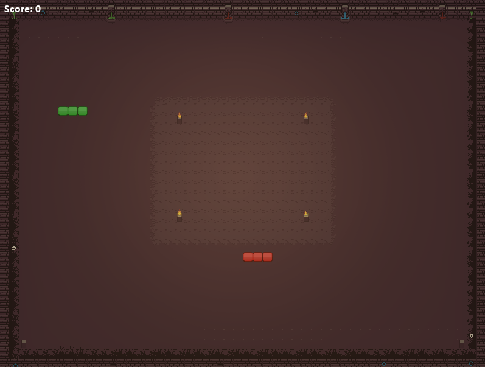
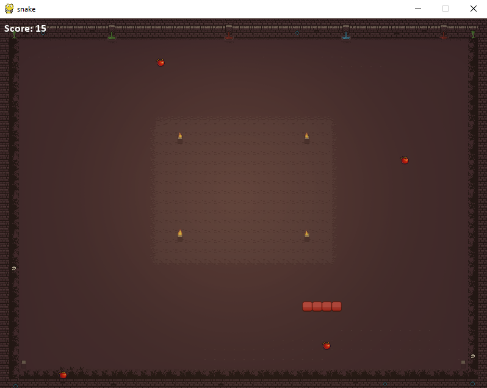
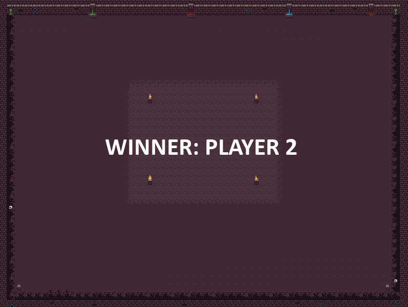
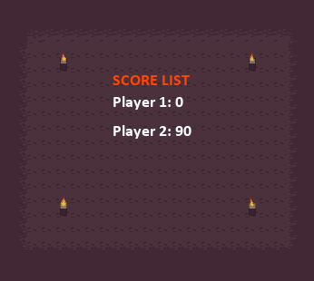

# Socket-Snake

##### Client-server architecture based multiplayer snake game using socket and pygame





### Features

- Score points by having other player snakes collide into your body (+100) or by eating food/tomatoes (+15).

- Custom self-made pixel graphics.

- Animated winner announcement at the end of the round, when the last surviving snake dies. 

  

- Leaderboard of scores for the game for all players displayed.

  

- Handles disconnection logic as well, so that the game is unaffected by disconnecting players and the room can be reused.
- Prevents players from connecting to the room during an ongoing game. 
- Both snakes are destroyed by head-on collision.
- Pygame required only on client-side, the job of the client is just to send player input to the server and display new snake and food positions in real-time.

**Note:** Each running server hosts only one room, and 16 player clients have been tested so far. Also, there are only 4 unique colors (RGBY) right now distributed evenly across connecting players to differentiate between snakes.


### Instructions

Start the game server:

```
python snake_Server.py "" <PORT> <NUM_PLAYERS>
```

As a player, to start the client application and connect:

```
python snake_Client.py <IP_ADDRESS> <PORT>
```

For localhost just leave the IP_ADDRESS as an empty string "" in both cases (loopback address 127.0.0.1 used in case of client automatically), otherwise public IP of the server is to be used by the client. PORTs must match.

For example, to test the game yourself with a single snake locally:

```
python snake_Server.py "" 5004 1
python snake_Client.py "" 5004
```


